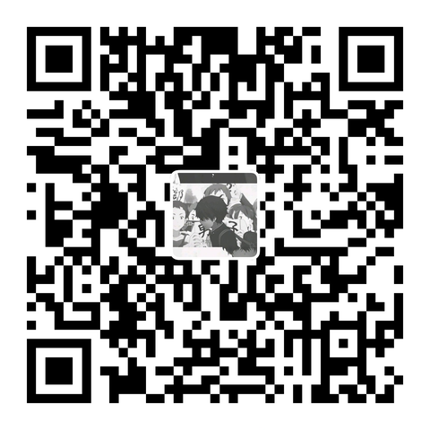

# Image Batch Downloader for ChatGPT

[简体中文](README.md) | **English**

A Chrome extension that lets you select and download a whole group of ChatGPT images at once, instead of saving them one by one.

> This is an independent project and is not affiliated with OpenAI.

## Features

- Adds a batch download button to ChatGPT's **generated image results** and **full-screen image viewer**
- Lists every image in the current group, all selected by default — uncheck any you don't want
- Click a thumbnail to open a large preview and browse back and forth
- Choose a local folder and save the selected images in one go, with per-image progress
- Retry failed images; existing files with the same name are never overwritten
- Chinese / English interface; follows ChatGPT's light or dark theme

## Screenshots

Generated results: click the button below the images (circled in red) to open the selection panel

Full-screen image viewer: batch selection works here too

Saved files: original images, numbered in order

## Install

The Chrome Web Store version is coming soon. For now, install it manually:

1. Open the [latest release](https://github.com/xin0907/gpt-image-batch-downloader/releases/latest), download `image-batch-download-x.y.z.zip`, and unzip it to a folder you will keep (don't delete or move it later).
2. Open `chrome://extensions` in Chrome and turn on **Developer mode** (top right).
3. Click **Load unpacked** and select the unzipped folder.
4. Refresh the ChatGPT page.

## Usage

1. In ChatGPT, open a group of generated images, or open the full-screen image viewer.
2. Click the batch download button:
   - Generated results: in the action button row below the images
   - Full-screen viewer: in the top-right toolbar, left of the zoom button
3. Check the images you want in the panel.
4. Click **Download selected**, choose a folder, and wait for it to finish.

Click the extension icon in the Chrome toolbar to switch the language or open this project on GitHub.

## Notes

- The extension saves the original image files provided by the page, without compression or conversion. It does not guarantee the files are identical to ChatGPT's own single-image download.
- If it cannot confirm the page has shown every image, it asks you to check the list. If an original image can't be found, it asks you to retry.
- ChatGPT redesigns may temporarily break the button or image detection. Please report problems by email.

## Privacy

Images are processed only in your browser and saved directly to the folder you choose. Nothing is uploaded to a developer server. The only thing stored is your language choice, locally. See the [Privacy Policy](PRIVACY.md).

## Support

If this tool helps you, you can optionally leave a tip. It does not unlock or change any feature.

| Alipay | WeChat |
| --- | --- |
|  |  |

## Contact & License

- Email: [xinyiu777@gmail.com](mailto:xinyiu777@gmail.com)
- Source code is under the [MIT License](LICENSE). The QR code images in `assets/` are not covered by the MIT License; see [assets/README.md](assets/README.md).
