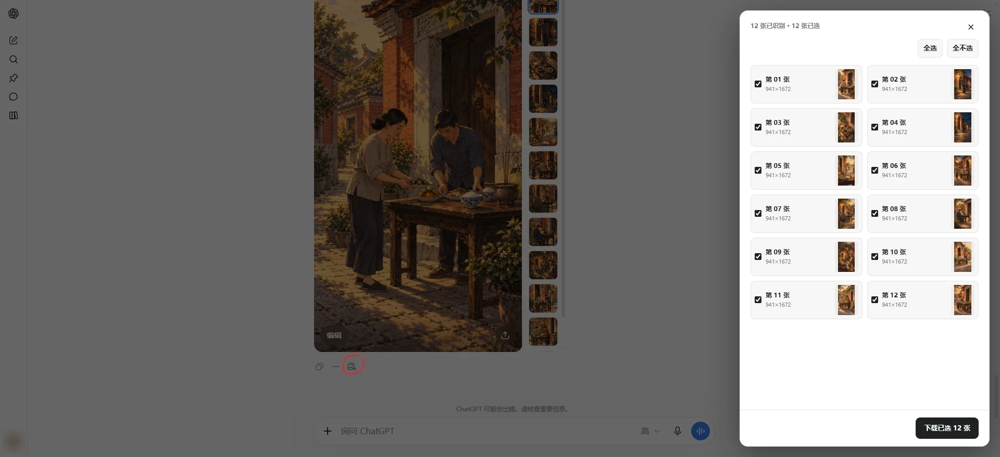
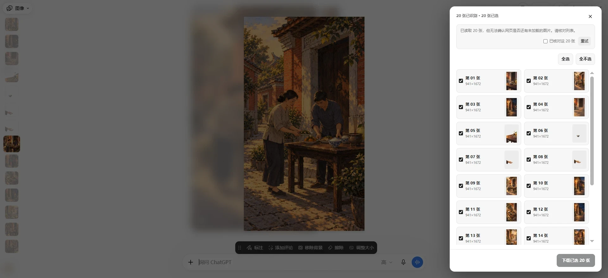
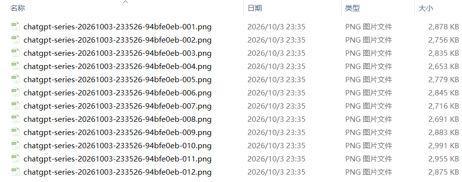
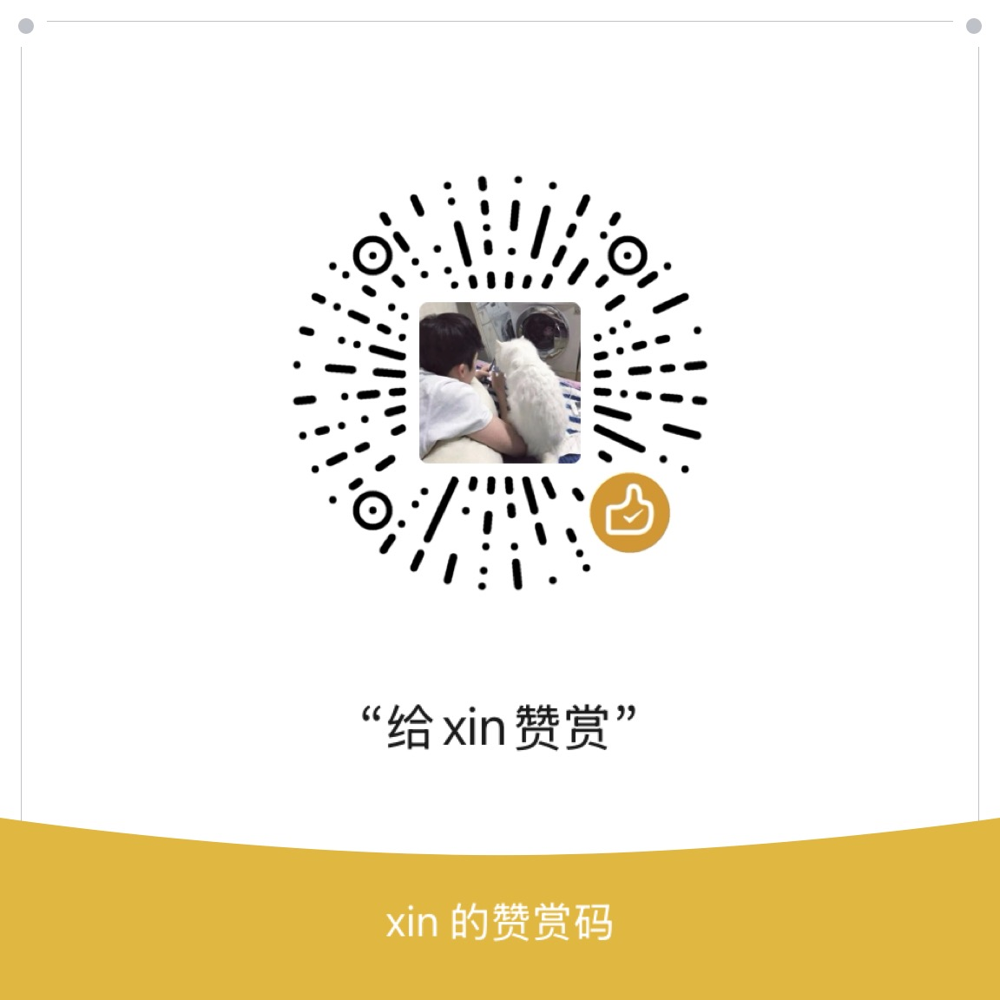

# 图片批量下载助手 for ChatGPT

**简体中文** | [English](README.en.md)

一个 Chrome 扩展：在 ChatGPT 的图片页面里，一次勾选并下载当前这一组图片，不用再一张一张点保存。

> 本项目由个人独立开发，与 OpenAI 没有关联。

## 能做什么

- 在 ChatGPT **生成结果页**和**全屏图片查看器**中添加一个批量下载按钮
- 列出当前图片组的所有图片，默认全选，可逐张取消
- 点缩略图可看大图，并可左右切换
- 选择一个本地文件夹后，一次性保存所选图片，并显示每张的进度
- 失败的图片可以重试；不会覆盖文件夹里已有的同名文件
- 支持中文 / English，跟随 ChatGPT 的亮色或暗色主题

## 效果预览

生成结果页：点击图片下方的按钮（红圈处）打开选择面板

全屏图片查看器：同样可以批量选择

保存结果：原图文件按顺序编号

## 安装

Chrome 应用商店版本即将上架，目前可以手动安装：

1. 下载本仓库（右上角 **Code → Download ZIP**），然后解压。
2. 在 Chrome 地址栏打开 `chrome://extensions`，打开右上角的 **开发者模式**。
3. 点击 **加载已解压的扩展程序**，选择解压后的文件夹。
4. 刷新 ChatGPT 页面。

## 使用

1. 在 ChatGPT 打开一组生成的图片，或进入全屏图片查看器。
2. 点击批量下载按钮：
   - 生成结果页：在图片下方的操作按钮那一行
   - 全屏查看器：在右上角工具栏、缩放按钮左边
3. 在弹出的面板中勾选要下载的图片。
4. 点击 **下载已选**，选择保存位置，等待完成。

点击 Chrome 工具栏中的扩展图标，可以切换语言，或打开本项目的 GitHub 页面。

## 注意事项

- 扩展直接保存网页提供的原始图片文件，不压缩、不转换；但不保证与 ChatGPT 自带的单张下载文件完全相同。
- 如果扩展不确定网页是否已经显示全部图片，会提示你核对；如果某张图片拿不到原图，会提示重试。
- ChatGPT 改版后，按钮位置或识别方式可能暂时失效。遇到问题欢迎发邮件反馈。

## 隐私

图片只在你的浏览器中处理，并直接保存到你选择的文件夹，不会上传到任何开发者服务器。扩展只在本地记住你选择的语言。详见 [隐私说明](PRIVACY.md)。

## 赞赏

如果这个工具对你有帮助，欢迎自愿赞赏，这不会影响任何功能。

| 支付宝 | 微信 |
| --- | --- |
|  |  |

## 联系与许可

- 邮箱：[xinyiu777@gmail.com](mailto:xinyiu777@gmail.com)
- 源代码使用 [MIT 许可证](LICENSE)。`assets/` 中的赞赏码图片不在 MIT 授权范围内，详见 [assets/README.md](assets/README.md)。
